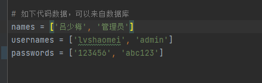
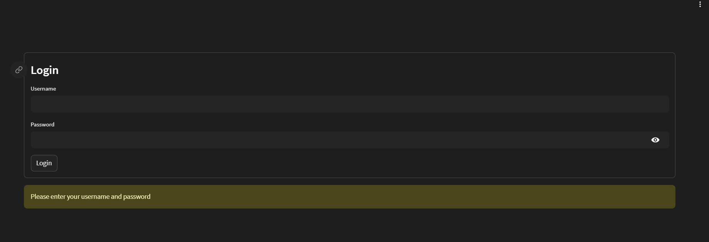
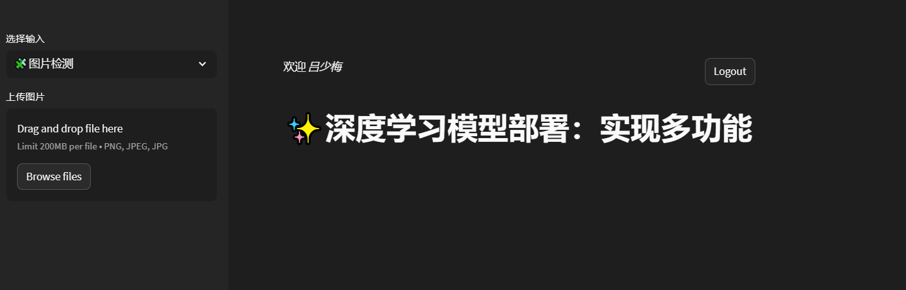
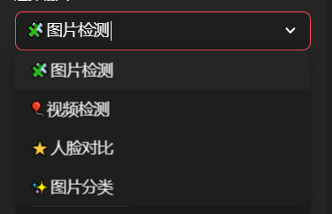
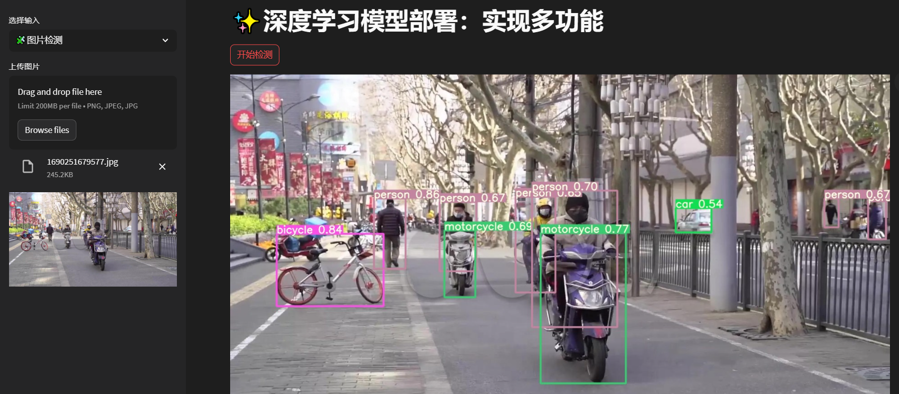
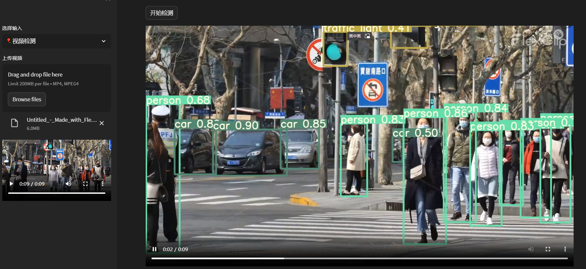
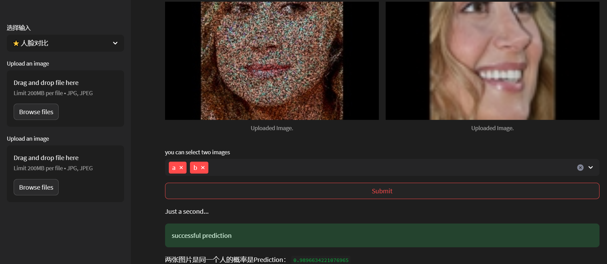
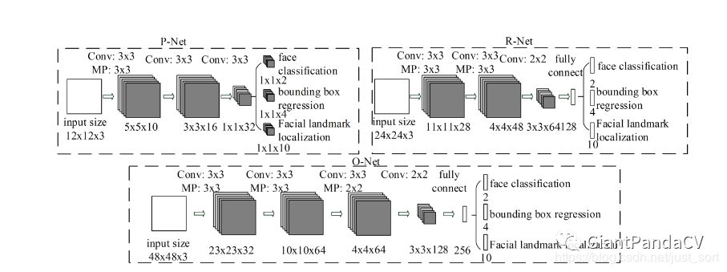
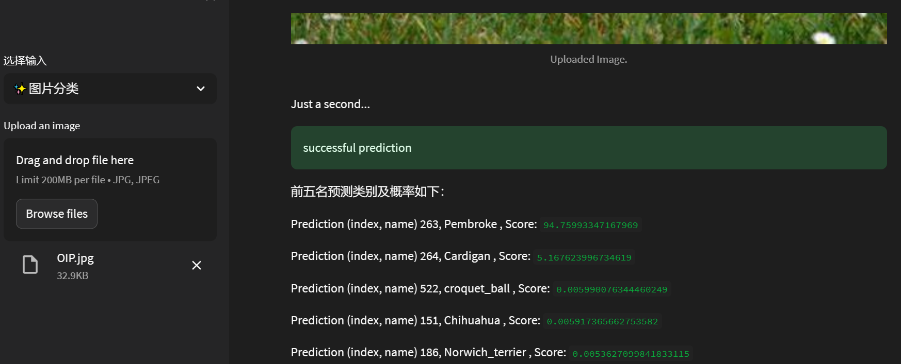

# ✨多功能streamlit_App

#### **深度学习模型部署实现图片检测、视频检测、人脸识别（判断是否是同一个人）、图片分类。**

注：人脸识别为自己实现的功能，具体详细的介绍下面已经给出。

# demo演示


# 安装依赖

`pip install -r requirements.txt    # 本地安装`

# 运行项目

首先现在人脸识别FaceModel文件夹中进行训练，得到model，然后将Facemodel.py文件中的pkl文件进行替换。然后在终端运行下面的命令。

`streamlit run login.py`




根据用户名和密码登录，然后进入主页面。








# 功能介绍
## a. 图片检测


## b. 视频检测

## c. 人脸识别

由于人脸识别功能是自己写自己训练得到的，所以下面将对代码进行详细介绍。


### 1. 训练模型数据集

```
CeleA前500个数据集和CASIA数据集
```

### 2. 数据处理

**说明**：由于`CeleA`和`CASIA`数据集不是单纯的人脸，所以用`MTCNN`模型提取人脸，然后保存到文件夹中。

#### 2.1 数据预处理

两个数据集包含的总的人脸个数和每个人的人脸个数数量不同，出现了数据不平衡的问题。所以在数据处理阶段我们采用**数据融合**的方法解决数据不平衡的问题，即将`CASIA`数据集和`CELEA`的前500个数据集进行融合。得到是数据存放在中间数据文件夹`temp_data`中。

1. `CASIA_face_detection.py`用于实现`CASIA`数据集的人脸检测并保存。`CASIA`数据集中同一个人有5张不同的图片。执行以下命令即可获得预处理后的`CASIA`数据集。

```shell
python CASIA_face_detection.py trainSetCASIA_Dir CASIA_face_train_save_path
【说明】
trainSetCASIA_Dir为数据集CASIA的路径，
CASIA_face_train_save_path为人脸检测后图片的保存路径。
```

2. `Data_processing_and_detection.py`实现`CELEA`数据集的人脸检测并保存。`CELEA`数据集同一个人有多张不同的图片（超过5张）。执行以下命令即可获得预处理后的``CELEA``数据集。

```shell
python Data_processing_and_detection.py identify_path img_path save_path CeleA_and_CASIA_save_path 
【说明】
identify_path为数据集CELEA的标签路径，
img_path为CELEA人脸图片路径，
save_path为人脸检测后图片的保存路径，
CeleA_and_CASIA_save_path为CeleA数据集完成编号后保存人脸图片的路径（实现从500开始编号）。
```

**经过以上两步的处理，我们得到预处理后的`CASIA`数据集和`CELEA`数据集。于是将两个数据集合并到同一个文件夹，其中包含1000个人的人脸图像，000-499来源于`CASIA`数据集，500-1000来源于`CeleA`数据集。**

#### 2.2 `MTCNN`模型原理

第一阶段是使用一种叫做`PNet`(Proposal Network)的卷积神经网络，获得候选窗体和边界回归向量。同时，候选窗体根据边界框进行校准。然后利用非极大值抑制去除重叠窗体。第二阶段是使用`R-Net`(Refine Network)卷积神经网络进行操作，将经过`P-Net`确定的包含候选窗体的图片在`R-Net`中训练，最后使用全连接网络进行分类。利用边界框向量微调候选窗体，最后还是利用非极大值抑制算法去除重叠窗体。第三阶段，使用`Onet`(Output Network)卷积神经网络进行操作，该网络比`R-Net`多一层卷积层，功能与`R-Net`类似。网络结构图如下。



### 3. 模型处理

#### 3.1 模型训练

```markdown
执行命令： python train.py trainSetDir modelPath
说明：将trainSetDir改为训练集所在的路径，将modelPath改为模型保存的路径。
```

#### 数据增强：从数据集随机选择两张图片，对其进行添加椒盐噪声，水平翻转、高斯噪声、平移缩放旋转，其中数据增强是随机的。

```python
transform = transforms.Compose([transforms.Resize((256, 256)),
                                AddPepperNoise(0.9,0.5),
                                transforms.ToTensor()])


albu_transfomem = A.Compose([A.HorizontalFlip(p = 0.5),
                             A.OneOf([
                                 A.IAAAdditiveGaussianNoise(),
                                 A.GaussNoise(var_limit=(10,80))
                             ],p=0.8),
                             A.ShiftScaleRotate(scale_limit = 0.1,rotate_limit=15,p=0.6)
                             ],p=0.6)
```

#### 训练参数设置

```python
train_epochs = 200
in_shape = [256, 256]
train_batch_size = 16
ptimizer = torch.optim.Adam(net.parameters(), 0.0001, betas=(0.9, 0.999)) #初始学习率为0.0001
torch.manual_seed(22) #随机种子，防止模型出现随机性
np.random.seed(22)
criterion = torch.nn.BCEWithLogitsLoss() # 交叉熵损失函数

```

#### 3. 2 模型预测

```markdown
执行命令： python test.py testSetDir resultPath
说明：将testSetDir改为测试集所在的路径，将resultPath改为结果保存的路径。
```

#### 3.3 模型原理

通俗的来说**`SENet`的核心思想在于通过网络根据loss去学习特征权重，使得有效的feature map权重大，无效或效果小的feature map权重小的方式训练模型达到更好的结果**。`SENet-154`的构建是将`SE`块合并到`64×4d ResNeXt-152`的修改版本中，该版本采用`ResNet-152`的块堆叠策略，扩展了原来的`ResNeXt-101`。`SE`结构图如下。


`SENET-154`与`SE`存在的其他差异如下：

- 将第一个7×7卷积层替换为3个连续的3 × 3卷积层
- `每个bottleneck building block`的前1 × 1个卷积通道的数量减半，以降低模型的计算成本，同时性能下降最小。
- 为了减少过拟合，在分类层之前插入一个`dropout layer (dropout ratio为0.2)`。
- 在训练过程中使用了标签平滑正则化。

## d. 图片分类




# 参考链接

[1] [streamlit](https://streamlit.io/)

[2] [YOLOv5 检测](https://github.com/xugaoxiang/yolov5-streamlit/tree/main)

[3] [图像分类](https://github.com/1648027181/image_classification_pytorch_app)


